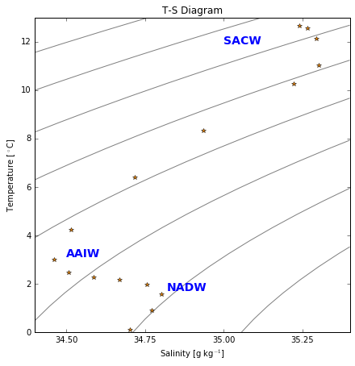
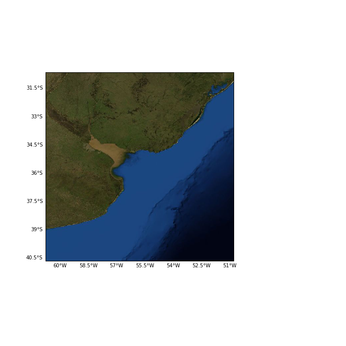
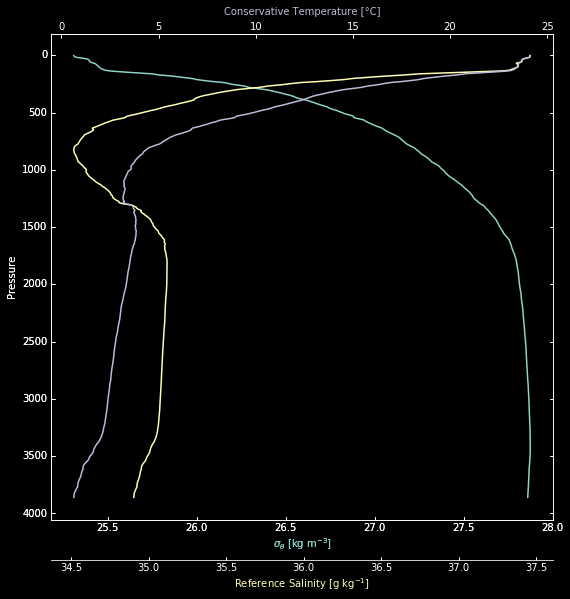
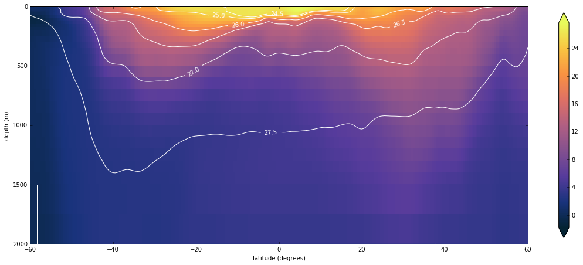
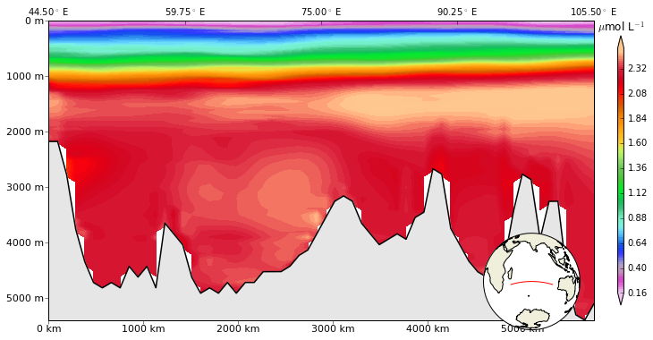
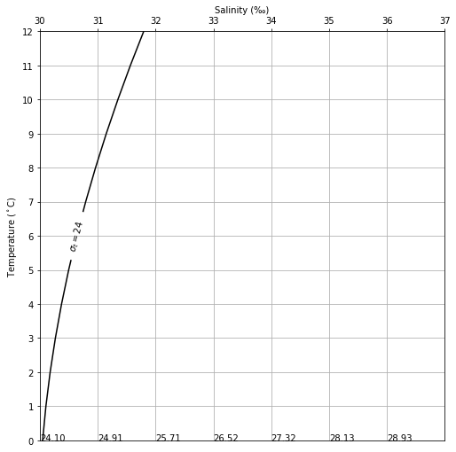
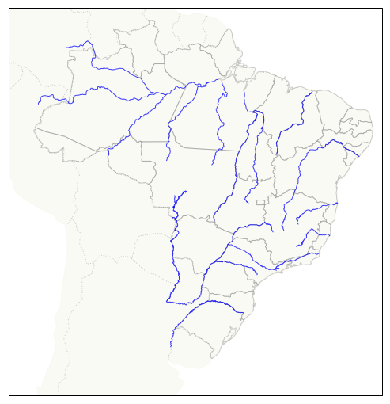

---
title:
layout: single
---

<a href="{{ site.url }}{{ site.baseurl }}//notebooks/water_mass"><figcaption>Annotated TS-diagram</figcaption></a>

<a href="{{ site.url }}{{ site.baseurl }}//notebooks/satellite_images_rivers"><figcaption>World major rivers</figcaption></a>

<a href="{{ site.url }}{{ site.baseurl }}//notebooks/ctd_profile"><figcaption>CTD profiles</figcaption></a>

<a href="{{ site.url }}{{ site.baseurl }}//notebooks/WOCE-temperature"><figcaption>WOCE temperature section</figcaption></a>

<a href="{{ site.url }}{{ site.baseurl }}//notebooks/WOA13_cross-sections"><figcaption>WOA13 cross sections</figcaption></a>

<a href="{{ site.url }}{{ site.baseurl }}//notebooks/TS-exercise"><figcaption>T-S plotting exercise</figcaption></a>

<a href="{{ site.url }}{{ site.baseurl }}//notebooks/Brazil_rivers"><figcaption>NE data</figcaption></a>

